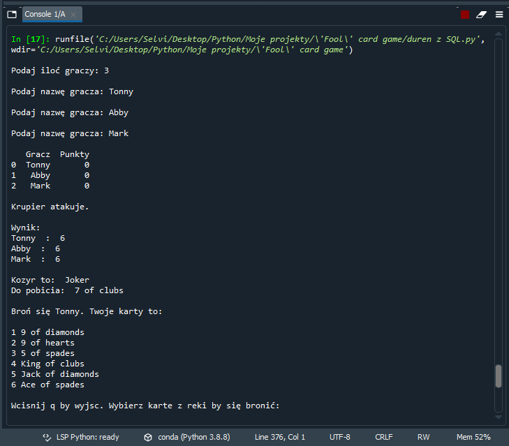

# 'Fool' card game
> This project presents a card game called 'The Fool'.

## Table of Contents
* [General Info](#general-information)
* [Technologies Used](#technologies-used)
<!--* [Features](#features)-->
* [Screenshots](#screenshots)
* [Project Status](#project-status)
* [Room for Improvement](#room-for-improvement)
* [Acknowledgements](#acknowledgements)
* [Contact](#contact)
<!-- * [License](#license) -->

## General Information
The aim of the game is to get rid of all the cards in your hand. The rules are described in detail in the file 'Game rules'. At the moment, the game is operated only via the console and does not have a front-end setting.

## Technologies Used
Program was created using Python 3.8 with usage of SQL databases.

Imported libraries:
- random (imported shuffle)
- sys (imported exit)
- sqlite3
- pandas (imported read_sql_query)
- numpy (imported ceil)

Other libraries planned for future use:
-time (imported sleep)
-mysql.connector

<!--## Features
List the ready features here:
- Awesome feature 1
- Awesome feature 2
- Awesome feature 3-->

## Screenshots

<!-- If you have screenshots you'd like to share, include them here. -->

## Project Status
Project is: _in progress_ .

## Room for Improvement
The next goal is to create graphic design for the game and hosting a server for allowing players to play on their own machines and in real-time. There are plans for reducing long lines of code while maintaining the transparency of the project.

To do:
- Reduction of unnecessary functions in the code
- Creating graphic design for the game
- Server support and hosting game for players

## Acknowledgements
This project was inspired by my friends from college with whom we came up with this game, developed the rules and modified them through college.

## Contact
Created by [@Paproch-K](kubacki.pat@gmail.com) - feel free to contact me!
